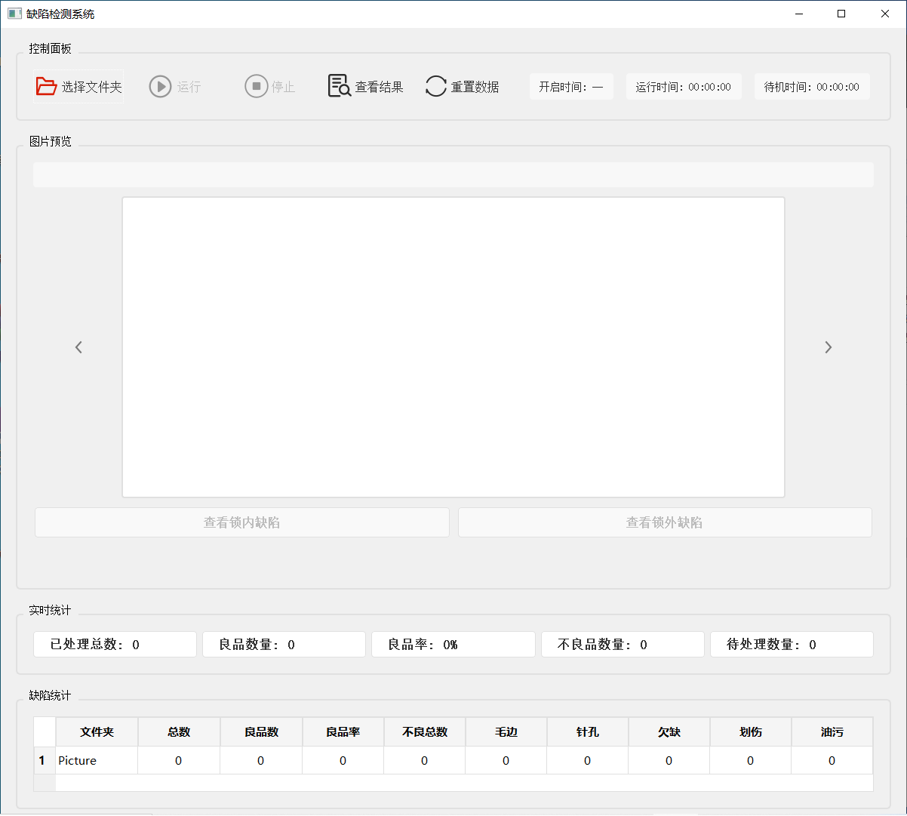
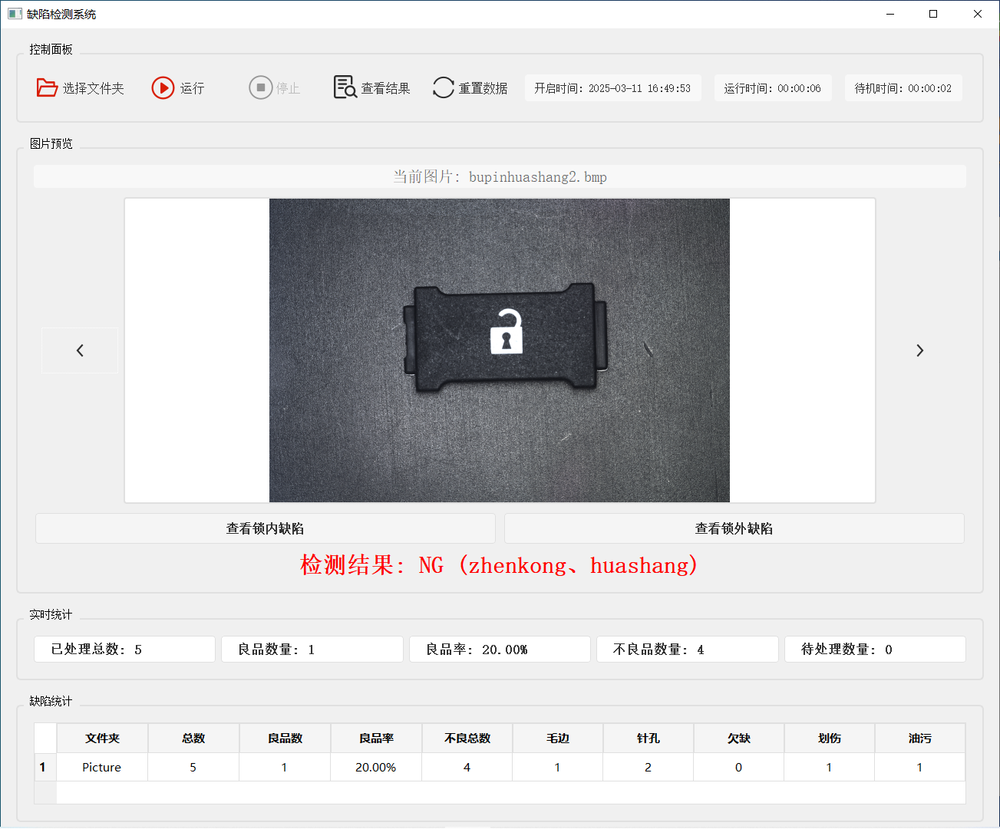
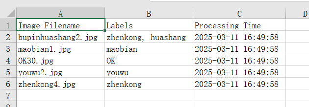
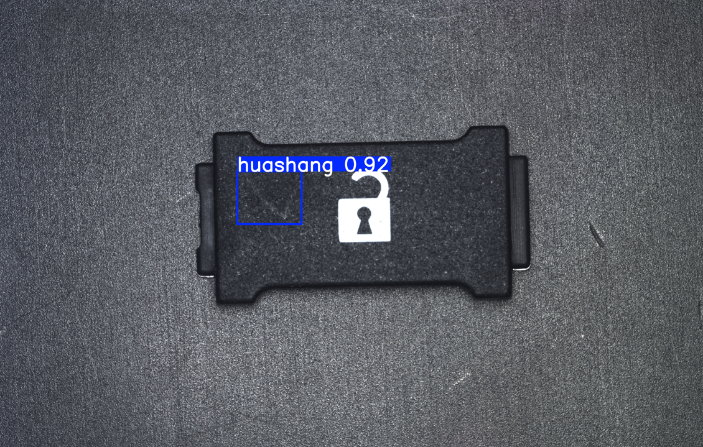
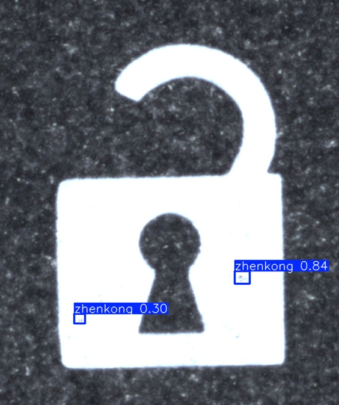

# Surface-Defect-Detection-Based-Yolov8
基于yolov8、pyqt5与opencv的缺陷检测系统，采用看门狗实时对文件夹内新增的图片进行检测并分类

使用yolo进行训练与推理的时候，均采用默认img_size，并区分远景与近景两部分，分别进行检测。近景的图片是通过yolo识别之后，再根据label数据标签编写脚本自动裁剪得到

## 系统界面

<<<<<<< HEAD
初始界面：
=======

>>>>>>> e2f1266c0c49d4ae0730d4cbb98c6a7cd552a04c


运行时：



结果生成与查看：



## 检测结果

远景：



近景：


<<<<<<< HEAD


## 开发日志

期限：半个月

### 2/20

**基本情况**

- 两种锁（开锁和闭锁）
- 两种零件（矩形和半圆形）
- 错误样本（划伤、毛边、欠缺(反向毛边)、色不均、印一次、印三次、油污、针孔）

**几个问题**

- **色不均、印一次、印三次**都无法很好的和OK样本区分（由于本身每次拍摄的光照就不统一，区分这几种错误的方式只能通过肉眼看，或者**极其明显的印一次**能够在图像中反应处背景的黑色，也就是锁会有点泛蓝）
- 正常印两次的边缘比较方正，**印三次**的有齿状、肥大（可能由于两次印刷位置不完全一样、颜料外溢等），可能可以考虑从这个方面入手


印刷问题极其明显的印一次


或许通过归一化光线等方式统一进行调整后判断

>  源自kimi

针对工厂中印刷白色图案的检测任务，由于不同印刷次数的图案在灰度值上存在差异，但又受到拍摄光线的影响，可以采用以下方法来解决：1. **图像预处理：光照归一化**光照归一化可以通过计算每个像素点的平均值和标准差，将图像转换为标准化形式，从而减少光照变化对图像的影响。具体实现如下：Python复制`def lighting_normalization(image):    mean = image.mean(axis=(0, 1))    std_dev = image.std(axis=(0, 1))    normalized_image = (image - mean) / std_dev    return normalized_image`2. **直方图均衡化**直方图均衡化可以调整图像的亮度分布，使图像中的像素灰度值更加均匀，从而减少光照变化的影响。可以使用全局直方图均衡化或自适应直方图均衡化（CLAHE）：Python复制`# 全局直方图均衡化gray_image = cv2.cvtColor(image, cv2.COLOR_BGR2GRAY)equalized_image = cv2.equalizeHist(gray_image)# 自适应直方图均衡化（CLAHE）clahe = cv2.createCLAHE(tileGridSize=(8, 8))clahe_image = clahe.apply(gray_image)`3. **深度学习模型：低照度图像增强**可以使用轻量级的低照度图像增强网络（如Illumination Adaptive Transformer, IAT）来处理图像，恢复在低光或过/欠曝光条件下的正常光照。这种方法可以显著改善图像质量，为后续的检测任务提供更好的输入。4. **特征提取与分类**在完成光照归一化和直方图均衡化后，可以提取图像的特征（如灰度值、颜色直方图等），并使用简单的机器学习模型（如SVM、KNN）或深度学习模型进行分类。例如：Python复制`# 提取灰度值特征avg_gray_value = np.mean(equalized_image)# 使用阈值分类threshold = 128  # 根据实际数据调整阈值if avg_gray_value < threshold:    print("Printed once")else:    print("Printed three times")`5. **多模态融合**如果条件允许，可以结合其他传感器数据（如红外图像）进行多模态融合，以提高对光照变化的鲁棒性。6. **数据增强**在训练阶段，可以通过数据增强技术（如调整亮度、对比度、色调和饱和度）来增加模型对光照变化的鲁棒性。总结通过以上方法，可以有效减少光照变化对图像的影响，从而更准确地检测印刷次数。具体选择哪种方法可以根据实际场景和数据特点进行调整。

- OK样本的上方（尤其左上方）也有油污，可能会与油污样本有重叠。但是油污样本普遍在零件最左边部分有油污，考虑是否不对零件最上方部分做检测。后来决定把这部分也算成是油污

**目前的处理方案**

- 利用cv库里本身的一些函数如模板匹配做检测，检测位置、形状等，目前能达到完全覆盖问题样本，但会错杀OK样本
- 想利用轮廓匹配去处理毛边等问题


### 2/21

由于数据集比较少，并且涉及到数据标注问题，考虑能否直接利用设置阈值进行区域RGB匹配的方法

- 划伤、色不均、印一次、油污、针孔 -> RGB
- 毛边、欠缺、印三次 -> 轮廓匹配

**尝试分析：**划伤（在区域内提取出白色噪点）、色不均（看看灰度）、印一次（看看灰度）、油污（白色噪点块）、针孔（白色噪点块）、毛边（轮廓）、欠缺（轮廓）、印三次（轮廓太肥）

**数据集图片数量较少的解决方案：**

>  源自kimi

当数据集较小（如只有40几张图片）时，直接使用深度学习模型（尤其是复杂的卷积神经网络）可能会面临过拟合的问题，因为模型参数过多而训练样本过少。在这种情况下，可以考虑以下几种方法来优化缺陷检测任务：**1. 数据增强（Data Augmentation）**通过数据增强技术扩充数据集，生成更多样的训练样本，从而提高模型的泛化能力。常见的数据增强方法包括：**旋转、翻转**：随机旋转（如0°、90°、180°、270°）和水平/垂直翻转。**裁剪和缩放**：随机裁剪图像的一部分或对图像进行缩放。**颜色调整**：调整亮度、对比度、饱和度等。**噪声添加**：在图像中添加高斯噪声或椒盐噪声。**模糊处理**：对图像进行轻微模糊处理。这些方法可以在训练时动态生成新的样本，增加模型对不同情况的适应能力。**2. 使用预训练模型（Transfer Learning）**预训练模型（如YOLOv8、ResNet等）已经在大规模数据集（如ImageNet）上进行了训练，具有很强的特征提取能力。您可以使用这些预训练模型，并在自己的小数据集上进行微调（Fine-Tuning）。微调可以分为以下几种策略：**全微调**：对整个模型的所有参数进行微调。**部分微调**：冻结预训练模型的部分层（通常是前面的卷积层），只训练后面的层（如全连接层）。**仅训练分类层**：如果数据集非常小，可以只替换模型的最后一层（分类层），并对其进行训练。**推荐模型**：**YOLOv8**：适合实时缺陷检测，对小数据集友好。**MobileNet或EfficientNet**：轻量级模型，适合小数据集。**3. 采用轻量级模型**如果数据集较小，可以考虑使用轻量级的深度学习模型，这些模型参数较少，更容易训练且不易过拟合。例如：**MobileNet**：轻量级的卷积神经网络，适合小数据集。**EfficientNet**：在性能和参数量之间取得了良好的平衡。**YOLOv8-Nano**：YOLOv8的轻量级版本，适合实时检测。**4. 使用无监督学习或半监督学习**如果标注数据不足，可以考虑以下方法：**无监督学习**：使用自编码器（Autoencoder）或变分自编码器（VAE）来学习正常样本的特征分布，然后通过重建误差来检测异常（缺陷）。这种方法不需要标注数据，但需要足够多的正常样本。**半监督学习**：结合少量标注数据和大量未标注数据进行训练。例如，使用伪标签方法（Pseudo-Labeling）为未标注数据生成标签，然后与标注数据一起训练。**5. 传统计算机视觉方法**如果深度学习方法仍然难以取得理想效果，可以考虑结合传统计算机视觉方法：**边缘检测**：使用Canny边缘检测算法检测图像边缘，然后分析边缘的连续性或断裂情况来判断缺陷。**形态学操作**：通过膨胀、腐蚀等操作增强图像特征，然后进行缺陷检测。**阈值分割**：根据颜色或灰度值将图像分割为前景和背景，分析分割后的区域来检测缺陷。**6. 多模型融合**如果单一模型效果不佳，可以尝试将多个模型（如深度学习模型和传统计算机视觉方法）结合起来。例如：使用深度学习模型检测明显的缺陷，然后用传统方法处理一些难以被深度学习模型捕捉的细节。**总结**对于只有40几张图片的数据集，建议采用以下策略：**数据增强**：扩充数据集，增加多样性。**预训练模型微调**：选择轻量级的预训练模型（如YOLOv8-Nano或MobileNet），仅训练最后一层或部分层。**结合传统方法**：在深度学习模型的基础上，结合边缘检测或阈值分割等传统方法，增强检测效果。如果仍然无法满足需求，可以考虑收集更多数据，或者与专业团队合作进一步优化模型。

如果进行图像增强的话，不能过度，否则会误触色不均和印一次

使用yoloV8进行微调，看是否需要改变模型参数

分析：因为OK样本的锁都比较标准，考虑能否分离前景背景，并将前景分为锁和其余部分

- 锁：色不均、印一次、毛边、欠缺、针孔、印三次
- 其余部分：划伤、油污

首要目标：先能判断出OK样本和NG样本，再对NG样本做分类

**暴力解法：对原图进行处理，只突出周围形状和中间的锁，然后进行相似度匹配——>怎么选相似度匹配方案？**


### 图像处理

图像处理OK样本与毛边样本的对比：

刮痕 降低亮度、拉高对比度、轻微降低杂色的效果：


毛边 降低亮度、拉高对比度的效果：（其实也有针孔）

 

印一次 处理同上：


针孔 处理同上：


印一次 比较明显  RGB对比


锐化会使得噪点变明显，模糊虽然能减轻但是对正常部分的影响也不小


### yolo

官网：<https://docs.ultralytics.com/zh/models/yolov8/>

Github：<https://github.com/ultralytics/ultralytics?tab=readme-ov-file>


**在CLI中使用**

```
# 训练数据集
yolo detect train data=datasets/alps/alps.yaml model=yolov8n.yaml pretrained=ultralytics/yolov8n.pt epochs=300 batch=4 lr0=0.01 resume=True

# 验证模型
yolo detect val data=datasets/alps/alps.yaml model=runs/detect/train/weights/best.pt batch=4

# 模型使用
yolo predict model=runs/detect/train/weights/best.pt source=datasets/NGsample save_txt=True
```

**在python中使用**

> ask yolo官网的AI

指定保存目录You can control the save directory by using the `project` and `name` arguments  [(1)](https://docs.ultralytics.com/usage/cfg) . Here's how:**For training/validation/prediction:**`# Specify project and name to control save locationmodel.predict(source="path/to/image.jpg", project="my_project", name="experiment1") `**The save directory is composed of** `**project**` **and** `**name**`**, where** `**save_dir = project/name**`  [**(2)**](https://github.com/ultralytics/ultralytics/issues/327) **.****Key parameters you can use**  [**(1)**](https://docs.ultralytics.com/usage/cfg) **:**`**project**` **(str): Name of the project directory where outputs are saved**`**name**` **(str): Name of the specific run/experiment**`**exist_ok**` **(bool): If True, allows overwriting existing project/name directory****For example:**`# Training with custom save locationmodel.train(data="coco128.yaml",            epochs=100,           project="custom_directory",           name="experiment1")# Prediction with custom save location  model.predict(source="image.jpg",             project="custom_directory",             name="test_predictions")`**These settings will create the specified directory structure and save all outputs (like weights, predictions, logs) to that location .**

不保存图片只保存标签要只输出标签而不保存检测图片，你可以使用`save_txt=True`参数并且不使用`save`参数:`from ultralytics import YOLOmodel = YOLO("path/to/best.pt")# 只保存标签文件results = model.predict(source="path/to/image.jpg", save_txt=True)` [(1)](https://github.com/ultralytics/ultralytics/issues/4318) 这样做会在输出目录中创建一个labels文件夹，其中包含每个检测到的目标的标签信息。每个txt文件对应一张输入图片，包含了检测结果的类别ID和坐标信息。如果你想要指定保存位置，可以添加project参数:`results = model.predict(source="path/to/image.jpg", save_txt=True, project="custom_directory")`这样标签文件会保存在你指定的目录下的labels文件夹中。


### resolve

**old**

- 先用图像处理（拉低亮度、拉高对比度）把所有图像处理一遍，凸显出锁之后，把锁会出现的问题先处理了，如果有问题的就直接筛去
- 怎么判断锁有问题呢 ——> 利用yolo进行分类的对比，即相似度判断
- 怎么判断锁之外的零件部分呢 ——> 利用opencv的边缘检测

是否需要对两种零件做区分？可以不需要。虽然有两种锁，但是可以用yolo来对两类锁来计算置信度。至于锁以外的部分处理方式都一样

### latest

- 锁内和零件内的缺陷分别处理，均使用yolo直接进行缺陷检测
- 先用检测锁的模型得到每张图片里锁的yolo格式的位置信息，然后利用脚本裁剪出锁的图片
- 单独对裁剪出的锁的图片进行细粒度的缺陷检测：毛边、针孔、缺陷
- 再对原图检测缺陷：油污、划伤

### 实验结果

[📎yolo.xls](https://www.yuque.com/attachments/yuque/0/2025/xls/23187920/1741133968031-83a592af-5cc4-401f-acbe-32176907cbc8.xls)

| 时间            | 训练   | dataset  | epoch   | 用途     | 效果             | predict               | 备注                                           |
| --------------- | ------ | -------- | ------- | -------- | ---------------- | --------------------- | ---------------------------------------------- |
| 2025/2/24 10:01 | train  | alps     | 200     | 检测锁   | 两种锁都能识别   | 7                     |                                                |
| 2025/2/24 11:28 | train2 | alps     | 67(ES)  | 检测锁   | 两种锁都能识别   | 8                     | 用来检测并截取出锁的部分                       |
| 2025/2/24 13:15 | train5 | quexian  | 300     | 检测缺陷 | 锁外的部分ok     | 9(OK样本)、10(NG样本) | 毛边针孔没学到，是分辨率的问题，所占像素太少了 |
| 2025/2/24 16:34 | train3 | lock     | 300     | 检测缺陷 | 截出的锁的部分ok | 11                    |                                                |
| 2025/2/25 8:51  | train4 | lock_val | 174(ES) | 检测缺陷 | 截出的锁的部分ok | 12                    |                                                |
| 2025/2/27 16:02 | train7 | unit     | 300     | 检测零件 | 两种零件都能识别 | 15                    |                                                |


### 2/24

<https://blog.csdn.net/weixin_45348389/article/details/108817789>

这篇文章是**对缺陷直接进行识别**，识别毛边和缺陷应该可以。但是由于样本印刷错误方式太多，所以还是靠整体相似度来比较试一下先

对整体锁图案进行detect：考虑要不要做过拟合。因为NG样本只要不是太离谱的，被认为是正常锁的置信度都不低，反正还是想靠整体相似度更严格一些判断来筛掉不好的

那能否提取边缘？提取边缘后只剩轮廓线段，一旦锁中间有洞、毛边一下就能看出来

锁以外的部分：之前想的解决办法也是通过边缘来检测

所以直接利用yolo的detect，将训练数据都先边缘化处理，再将这些简图送入模型去学习。这样又能通过置信度判断锁像不像，又能检测出外面的油污划伤之类的。**但是感觉最好分为两个模型，锁就单独处理，因为设计到过拟合的问题，如果模型过拟合可以识别出锁的话，外面的划伤之类可能不好识别**

注意锁内锁外的图像预处理方式可能不一样，这个问题的思路：对每张图片copy成两份，文件名前部分都一样，后部分简单区分。然后送入到yolo中进行两次detect，最终预测出来的图片是在原始没做预处理的图像上画框，框来自这两次detect的结果。这需要改一下yolo。

色不均/印一次可能还需要特殊处理方法？

**考虑怎么做边缘化最合适，怎么让缺陷变得明显，最重要的应该在图片的预处理部分**

使用yolo对缺陷detect的结果：油污、刮痕可以检测出来，但是锁里面的毛边、缺陷等检测不出来。**经坚定是分辨率的问题**

——> 那就这个模型用于检测外面的，然后再搞一个单独锁的数据集来处理锁的

那对于新的数据怎么处理？也分别处理两次。所以需要搞一个自动脚本，能将图片中的锁的图案自动提取出来

**这种方法印一次检测不出来   印三次、印刷偏移也用opencv的position和shape模板匹配**

**车间光源不固定问题**：车间光源可调，目前的数据集都是强光下拍摄的，如果光不同，考虑统一对图片进行亮度、对比度预处理


### 2/25

考虑整合两个模型，最终统一在原图上给出判断

考虑到在原图上标出锁里的缺陷不够显眼且容易重叠，所以两个模型直接分开给出结果好像也行，可以最终生成以下格式的文件

文件格式./Predict||——整体结果.xsl（以表格形式记录每张图是否有缺陷、有哪些缺陷）|——检测结果||——整张图|——pic1.bmp|——pic2.bmp|—— ····|——单独锁|——pic1.bmp|——pic2.bmp|—— ····

使用上述思路，目前使用yolo的部分已经整合完成，考虑融合进openCV的模板匹配。关键在于excel的填写，检测印刷歪斜、部品缩水等问题，以及打包创建简单GUI。


### 2/26

为程序编写GUI以及打包工作

GUI已使用tkinter编写完成


### 2/27

利用之前的shape和position比对去筛选出印刷偏移、缩水等问题

解决思路：遍历excel里的label，找到label为ok对应的图片，对这些图片的outside去用opencv来检测，如果检测不通过则在图片上用cv的框来框出问题并保存处理后的图片

之前利用opencv检测时的输入是手动截出来的零件图片，考虑先用yolo自动识别出之后裁剪出零件，再使用opencv处理

yolov8n原模型直接检测的话能把大部分零件都检测成为suitcase，但没法全部识别，所以继续标注数据集，并且训练检测零件的模型

**训练了模型train7，并且在搞印一次RGB空间的问题**


### 2/28

yolo处理之后把ok的再用RGB检测一次

关于opencv之前做法是手动旋转的问题，实际工厂拍摄的图片是角度固定的

**打包**

- pyinstaller xx.py
- 如果缺少库，则conda install xxx


### opencv

**0130_lvbo_2.py：** 使用 OpenCV 提取指定颜色范围的区域，并将颜色范围外的区域设为透明

0130_lvbo_2.py**图像加载与转换：**使用 `cv2.imread` 读取图像文件。使用 `cv2.cvtColor` 将图像从 BGR 色彩空间转换为 RGB 色彩空间（OpenCV 默认使用 BGR）。**颜色范围阈值处理：**`lower_threshold` 和 `upper_threshold` 定义了你希望提取的颜色范围。使用 `np.array` 来设置颜色范围的下界和上界。使用 `cv2.inRange` 函数创建掩码，掩码中符合阈值范围的像素值为白色（255），不符合的为黑色（0）。**Alpha 通道创建：**创建一个新的 alpha 通道（透明度通道），初始值为 255（完全不透明）。将掩码值为 0（即不符合颜色范围的区域）的地方，alpha 通道设置为 0（完全透明）。**合并 RGB 图像与 Alpha 通道：**将 RGB 图像和 alpha 通道拼接成一个 RGBA 图像，其中 alpha 通道代表透明度。**保存结果图像：**使用 `cv2.imwrite` 将最终的 RGBA 图像保存为 PNG 格式，以便保存透明度。如何使用：**图像路径：** 将 `image_path` 变量指向你要处理的图像路径。**颜色范围：** 根据需要调整 `lower_threshold` 和 `upper_threshold` 来定义你想要提取的颜色范围。例如，当前的 `[245, 245, 245]` 到 `[255, 255, 255]` 是用来提取白色或接近白色的区域。**输出路径：**`output_path` 是处理后图像的保存路径。可能的问题和注意事项：**图像格式：** 确保输入图像（`.bmp` 格式）支持 RGB 转换。**透明度处理：** OpenCV 本身不一定支持所有格式的 alpha 通道，所以保存为 `.png` 格式是必要的，这样可以保存透明区域。**阈值调整：** 根据图像的实际内容，可能需要调整颜色范围的阈值，以便准确提取需要的颜色。原图：转换后：

**0202_check_01_rectangle.py：** 该脚本的功能是对文件夹中的每张图像进行处理，比较每张图像中的“锁图标”与模板图像的相似度，使用模板匹配、重叠区域比率、距离等多个指标进行分析，并根据结果标注“OK”或“NG”。最终，将分析结果保存到指定的输出文件夹

从lock文件夹里获取锁的模板，然后对original里经过裁剪的图片进行模板匹配，计算出模板锁应该在待匹配图片里的最佳位置（max_loc_lock），也就是红色框的位置

0202_check_01_rectangle.py主要步骤和功能：**加载图像：**读取待处理图像和锁图标模板图像。**模板匹配：**使用 `cv2.matchTemplate()` 对待处理图像和模板图像进行匹配，找出图像中的锁图标，并计算匹配度。**距离计算：**使用 `calculate_distance()` 和 `calculate_center_distance()` 计算两个矩形之间的平均距离和中心点距离。**重叠区域计算：**通过 `calculate_overlap_area()` 和 `calculate_overlap_ratio()` 计算两个矩形的重叠面积及其比率。**评估锁图标的匹配结果：**通过多个参数（如相似度、重叠面积比率、位置阈值等）判断锁图标的匹配情况。若符合条件，则标注图像为“OK”；否则，标注为“NG”。**输出：**将处理后的图像保存在指定的输出文件夹，并添加标注结果。具体的功能和分析：**模板匹配：** 计算图像中的锁图标位置，若匹配度大于设定阈值（`threshold_lock`），则认为检测到了锁图标。**重叠区域和相似度：** 根据检测到的锁图标与模板图标之间的重叠区域比率来判断匹配情况。**结果输出：** 在每张图像上标注“OK”或“NG”，并将处理后的图像保存到指定路径。代码修改和改进建议：**文件路径处理：**你使用了 `os.path` 和 `pathlib` 来获取文件路径，这样是非常好的实践，保证了路径的跨平台兼容性。**判断条件：**`sumpic/countpic` 和 `summ/countpic` 用于计算平均相似度和重叠比率，结合阈值判断图像是否符合“OK”或“NG”标准。可以通过优化这些判断条件进一步提高判断精度。**输出标注：**通过 `cv2.putText()` 给图像添加标注文字，清晰标明了每个图像的检测状态及各项指标。如果你希望提高文字的可读性，考虑根据不同图像的尺寸动态调整文字位置，避免文字超出图像区域。**优化和测试：**如果图像中有多个锁图标，可以考虑增加对多个模板匹配的处理，并对多个匹配结果进行综合分析。测试不同阈值的效果，调整 `threshold_lock` 和 `threshold_test` 以获得最佳结果。输出示例：代码会对每张图像进行分析，并生成结果图像，保存路径为 `output_folder` 文件夹下，文件名为原文件名加上 `-result.jpg` 后缀。使用方法：**输入文件夹：** 图像文件存放在 `input_folder` 文件夹。**锁图标模板文件夹：** 锁图标模板文件存放在 `lock_folder` 文件夹。


### 3/10

完整流程：拍照（得到bmp文件）、存储到某个文件夹、程序实时监测文件夹里新增的图片、检测到图片就输入到程序里判断并得到结果、将文件夹的图片分类到NG和OK两个文件夹


=======
>>>>>>> e2f1266c0c49d4ae0730d4cbb98c6a7cd552a04c
